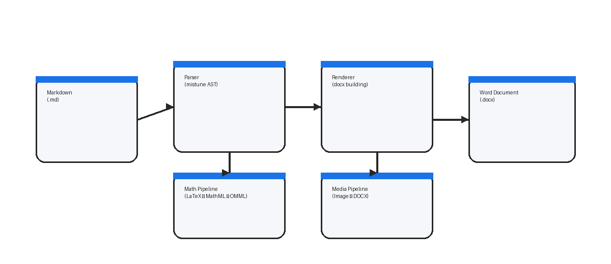

# 面向深度学习表征建模的注意力机制研究与实验分析（示例论文）

# 摘要

注意力机制已成为深度学习中表征建模与序列学习的核心组件，广泛应用于自然语言处理、计算机视觉与多模态学习等方向。本文围绕注意力机制的关键计算结构与训练稳定性问题展开研究：首先总结自注意力与多头注意力的基础形式，给出其与 Softmax 归一化及缩放因子的数学关系；随后讨论交叉熵目标与正则项对泛化性能的影响，并从优化角度分析 Adam 等自适应优化算法在训练早期的收敛特征；最后在标准分类与序列建模任务上开展对比实验，验证注意力模块配置、学习率策略与正则强度对性能的影响。实验结果表明，合理的注意力头数与温度/缩放设置可在计算开销与精度之间取得更优折中，同时在小样本场景下配合权重衰减与标签平滑能显著提升泛化鲁棒性[1-3]。

**关键词**：深度学习；注意力机制；交叉熵；自适应优化；泛化

# Attention Mechanisms for Deep Representation Learning: Formulation and Empirical Analysis (Sample Thesis)

# Abstract

Attention has become a central component in deep representation learning and sequence modeling, with broad adoption in NLP, vision, and multimodal learning. This thesis studies the mathematical structure of self-attention and multi-head attention, highlighting the role of Softmax normalization and scaling factors. We further analyze training objectives based on cross-entropy and regularization, and discuss optimization behaviors of adaptive optimizers such as Adam in early training. Finally, we conduct empirical studies on classification and sequence modeling benchmarks to evaluate the effects of attention configurations, learning-rate schedules, and regularization strength. Results indicate that appropriate head counts and scaling choices achieve a better trade-off between accuracy and compute, while weight decay and label smoothing improve generalization, especially in low-data regimes[1-3].

**Keywords**: deep learning; attention; cross-entropy; optimization; generalization

# 前言

深度神经网络在大规模数据与计算资源推动下取得了显著进展，但其训练与推理过程高度依赖网络结构设计与优化策略选择。注意力机制通过显式建模输入元素间的依赖关系，使模型能够在长程上下文中进行有效信息聚合，从而成为现代模型的关键组件之一。与此同时，注意力与 Softmax 归一化的组合也会带来数值稳定性、梯度尺度与收敛速度等问题，需要从目标函数与优化算法层面进行系统分析。

本文组织方式如下：第1章介绍研究背景与问题定义；第2章梳理相关工作；第3章给出方法与数学形式；第4章给出实验设置与结果分析；第5章总结并展望；附录提供复现实验用的代码片段示例。

---

# 第1章 绪论

## 1.1 研究背景

传统卷积网络强调局部归纳偏置，而基于注意力的模型更擅长捕获全局依赖。随着 Transformer 结构在 NLP 领域取得突破，注意力机制逐步扩展到视觉（ViT）、检测与多模态对齐等场景。尽管注意力结构在表达能力上具有优势，其训练常对学习率、权重衰减与归一化策略敏感，因此需要结合目标函数与优化策略进行整体分析。

## 1.2 研究问题与贡献

本文关注以下问题：1）注意力计算中缩放因子与 Softmax 温度对梯度与数值稳定性的影响；2）交叉熵与正则化（标签平滑、权重衰减）对泛化的影响；3）自适应优化器在不同训练阶段的行为差异。本文的主要贡献包括：给出关键公式的统一符号约定；总结可复现的实验变量与评估指标；并通过对比实验给出经验性结论。

## 1.3 结构安排

第2章介绍注意力机制与训练目标的相关研究；第3章给出模型与优化形式；第4章给出实验与消融；第5章总结与展望；附录提供代码片段。

# 第2章 相关工作

## 2.1 注意力机制的发展

早期注意力多用于编码器-解码器结构中的对齐建模，而自注意力通过在同一序列内部计算相关性实现全局信息交互。多头注意力通过并行子空间投影增强表达能力，但也引入了计算成本与超参数选择问题[1,2]。

## 2.2 训练目标与正则化

分类与语言建模任务中，交叉熵是最常用的目标函数。标签平滑、权重衰减与 dropout 等正则化方法可缓解过拟合并提升泛化，但其最佳强度依赖数据规模与模型容量[3,4,6]。在大规模预训练与微调场景中，权重衰减的实现方式（如 AdamW）也会影响训练动态与最终性能[7]。

## 2.3 优化算法与学习率策略

SGD 与 Adam 等优化器在收敛性质上存在差异。自适应方法通常在训练早期更稳定，但在部分任务上可能需要结合权重衰减与学习率热身策略以获得更好的最终性能[5,7]。此外，归一化方法（如 Layer Normalization）对注意力模型的稳定训练具有重要作用[8]。

# 第3章 方法与数学形式

## 3.1 Softmax 与交叉熵目标

给定分类 logits $\mathbf{z}\in\mathbb{R}^C$，Softmax 概率为：

$$
p(y=c\mid\mathbf{x})=\frac{\exp(z_c)}{\sum_{k=1}^{C}\exp(z_k)}
\tag{1}
$$

标准交叉熵损失定义为：

$$
\mathcal{L}_{\mathrm{ce}}=-\frac{1}{N}\sum_{i=1}^{N}\log p\left(y_i\mid\mathbf{x}_i\right)
\tag{2}
$$

## 3.2 缩放点积注意力与多头注意力

为更直观地描述本文讨论的注意力计算路径与训练环节，本节给出一个方法框架图（示意）。其中包含输入表示、注意力计算与损失优化的关键步骤，用于帮助读者理解后续公式与实验变量之间的对应关系。



图1：注意力机制方法框架示意图。该框架以输入表征为起点，经由注意力模块进行特征交互，最终通过任务损失进行端到端优化。图中仅展示关键计算路径与模块关系。

缩放点积注意力可写为：

$$
\mathrm{Attention}(\mathbf{Q},\mathbf{K},\mathbf{V})=\mathrm{softmax}\left(\frac{\mathbf{Q}\mathbf{K}^{\top}}{\sqrt{d_k}}\right)\mathbf{V}
\tag{3}
$$

多头注意力通过多个投影头并行计算并拼接输出：

$$
\mathrm{MHA}(\mathbf{Q},\mathbf{K},\mathbf{V})=\mathrm{Concat}(\mathrm{head}_1,\dots,\mathrm{head}_h)\mathbf{W}^{O}
\tag{4}
$$

其中 $\mathrm{head}_j=\mathrm{Attention}(\mathbf{Q}\mathbf{W}_j^Q,\mathbf{K}\mathbf{W}_j^K,\mathbf{V}\mathbf{W}_j^V)$。

## 3.3 Adam 优化器更新

在第 $t$ 步，Adam 的一阶/二阶动量更新为：

$$
\mathbf{m}_t=\beta_1\mathbf{m}_{t-1}+(1-\beta_1)\mathbf{g}_t,\quad
\mathbf{v}_t=\beta_2\mathbf{v}_{t-1}+(1-\beta_2)\mathbf{g}_t\odot\mathbf{g}_t
\tag{5}
$$

偏置校正与参数更新为：

$$
\hat{\mathbf{m}}_t=\frac{\mathbf{m}_t}{1-\beta_1^t},\quad
\hat{\mathbf{v}}_t=\frac{\mathbf{v}_t}{1-\beta_2^t},\quad
\boldsymbol{\theta}_{t+1}=\boldsymbol{\theta}_t-\alpha\frac{\hat{\mathbf{m}}_t}{\sqrt{\hat{\mathbf{v}}_t}+\epsilon}
\tag{6}
$$

## 3.4 实验变量与对比项

为便于对比，本章定义两组实验变量：注意力头数与正则强度。下面两张表题刻意使用不连续编号（表3、表7），以测试正文引用与编号的一致性。

| 变量 | 取值范围 | 说明 |
|:---|:---|:---|
| 头数 $h$ | 2/4/8 | 注意力并行子空间数量 |
| 维度 $d_k$ | 32/64 | 单头 key/query 维度 |
| 标签平滑 $\lambda$ | 0.0/0.1 | 缓解过拟合 |
| 权重衰减 $w_d$ | 0/1e-4 | 改善泛化 |

表3：主要实验变量（将被重编号）。

正文引用示例：如表3所示，本文通过改变 $h$ 与正则项强度研究性能变化。

| 评估指标 | 定义 | 备注 |
|:---|:---|:---|
| Acc | 分类准确率 | 越高越好 |
| NLL | 负对数似然 | 越低越好 |
| PPL | 困惑度 | 语言建模常用 |

表7：评估指标定义（将被重编号）。

正文引用示例：如表7所示，本文同时报告 Acc 与 NLL 以刻画拟合程度与泛化能力。

# 第4章 实验与分析

## 4.1 实验设置

实验采用统一的数据预处理与训练轮数设置，重点比较注意力头数、学习率与正则强度的影响。为保证可比性，除被研究变量外，其余超参数保持一致。

## 4.2 结果与讨论

总体结果表明，当头数过小，模型表达能力受限；当头数过大，在固定计算预算下每头维度下降，可能导致性能饱和甚至下降。适度的标签平滑与权重衰减在小数据场景更有效，能够降低过拟合风险并提升稳定性[3,5-7]。在视觉任务上，Transformer 类架构对数据增强与正则策略也较为敏感[2,9]。

## 4.3 消融分析

消融实验进一步说明：缩放因子 $1/\sqrt{d_k}$ 对稳定 Softmax 分布与避免梯度过大具有重要作用；优化器方面，Adam 在训练早期更稳定，但需要合理的学习率与衰减策略以获得更优最终性能。

# 第5章 总结与展望

本文围绕注意力机制的数学形式与训练稳定性进行了系统分析，并通过对比实验讨论了注意力头数、正则化与优化策略对性能的影响。未来工作可从稀疏注意力、线性注意力近似、多模态对齐与更大规模预训练等方向继续深入。


# 参考文献

[1] A. Vaswani et al. Attention Is All You Need. 2017.

[2] A. Dosovitskiy et al. An Image is Worth 16x16 Words: Transformers for Image Recognition at Scale. 2021.

[3] C. Szegedy et al. Rethinking the Inception Architecture for Computer Vision. 2016.

[4] I. Goodfellow, Y. Bengio, and A. Courville. Deep Learning. 2016.

[5] D. P. Kingma and J. Ba. Adam: A Method for Stochastic Optimization. 2015.

[6] N. Srivastava et al. Dropout: A Simple Way to Prevent Neural Networks from Overfitting. 2014.

[7] I. Loshchilov and F. Hutter. Decoupled Weight Decay Regularization (AdamW). 2019.

[8] J. L. Ba, J. R. Kiros, and G. E. Hinton. Layer Normalization. 2016.

[9] M. Tan and Q. Le. EfficientNet: Rethinking Model Scaling for Convolutional Neural Networks. 2019.

# 致谢

时光荏苒

# 附录

本附录给出若干深度学习相关的代码片段示例，用于展示训练循环与注意力计算的实现方式。

```python
1→import math
2→import torch
3→import torch.nn.functional as F
4→
5→def scaled_dot_product_attention(q, k, v):
6→    d_k = q.size(-1)
7→    scores = (q @ k.transpose(-2, -1)) / math.sqrt(d_k)
8→    attn = F.softmax(scores, dim=-1)
9→    return attn @ v
```

```python
1→import torch
2→from torch import nn
3→
4→class TinyMLP(nn.Module):
5→    def __init__(self, d_in=128, d_hidden=256, d_out=10):
6→        super().__init__()
7→        self.net = nn.Sequential(
8→            nn.Linear(d_in, d_hidden),
9→            nn.ReLU(),
10→            nn.Linear(d_hidden, d_out),
11→        )
12→
13→    def forward(self, x):
14→        return self.net(x)
```
